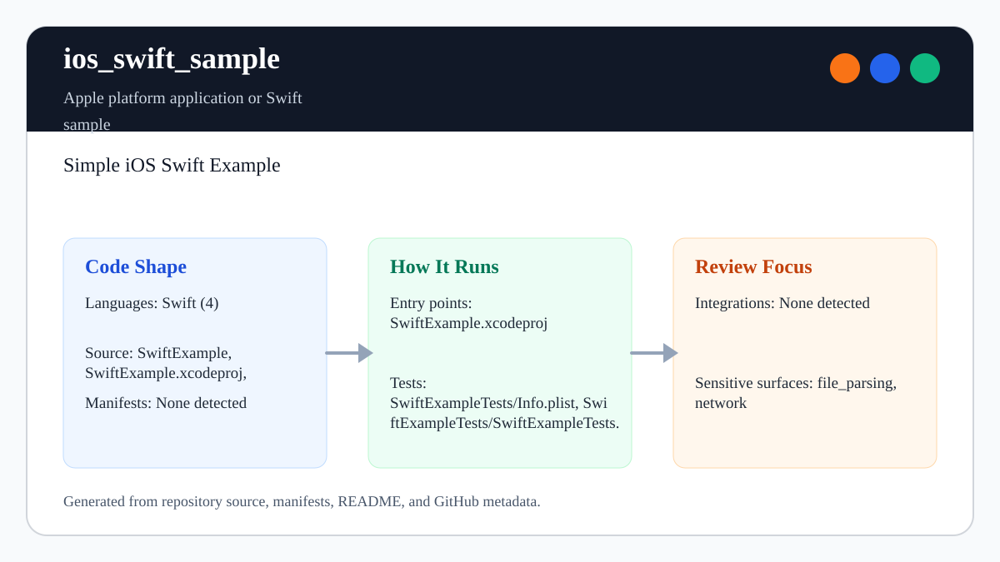

# ios_swift_sample

<!-- README-OVERVIEW-IMAGE -->


## Overview

`garethpaul/ios_swift_sample` is an Apple platform application or Swift sample. Simple iOS Swift Example

This README is based on the checked-in source, manifests, scripts, and repository metadata on the `master` branch. The project language mix found during review was: Swift (4).

## Repository Contents

- `README.md` - project overview and local usage notes
- `CHANGES.md` - recent maintenance changes
- `Makefile` - local static verification entry point
- `SECURITY.md` - security reporting and disclosure guidance
- `scripts/check-baseline.py` - static Swift/Xcode baseline checks
- `SwiftExample` - source or example code
- `SwiftExample.xcodeproj` - Xcode project file
- `SwiftExampleTests` - source or example code
- `VISION.md` - project direction and maintenance guardrails

Additional scan context:

- Source directories: SwiftExample, SwiftExample.xcodeproj, SwiftExampleTests
- Dependency and build manifests: none detected
- Entry points or build surfaces: `make lint`, `make test`, `make build`, `make check`, SwiftExample.xcodeproj
- Test-looking files: SwiftExampleTests/Info.plist, SwiftExampleTests/SwiftExampleTests.swift

## Getting Started

### Prerequisites

- Git
- Python 3 for static verification with `make lint`, `make test`, `make build`, and `make check`
- macOS with Xcode for building Apple platform projects

### Setup

```bash
git clone https://github.com/garethpaul/ios_swift_sample.git
cd ios_swift_sample
make lint
make test
make build
make check
```

The setup commands above are derived from repository files. Legacy mobile, Python, or JavaScript samples may require older SDKs or package versions than a modern workstation uses by default.

## Running or Using the Project

- Open `SwiftExample.xcodeproj` in Xcode, choose the app or sample scheme, and run it on the matching simulator/device.
- The sample queries the public HTTPS iTunes Search API and renders the JSON `results` array in a table view.
- Network, URL, JSON, missing result, and missing artwork failures should return an empty or partially rendered table state instead of crashing.
- API responses must use a successful status and JSON-compatible MIME type and
  remain within a 1 MiB declared and streamed body limit. Cancellation and
  failure callbacks deliver at most one completion.
- API completion clears the retained response buffer after delivering parsed or empty results.
- API results hop back to the main thread before updating table data, reloading the table, or clearing the network activity indicator.
- The network activity indicator is also cleared when the results view disappears before completion.
- Table rendering validates the row index before reading from the parsed results array.
- Result array tests cover accepted API arrays and malformed payloads that should clear stale table data.
- Async artwork loading accepts only HTTPS `mzstatic.com` artwork URLs from the iTunes response, clears reused image views before loading, fetches image data off the main thread, and applies images back on the main thread only if the cell still represents the same index path. Malformed or untrusted artwork URL values leave the image empty. Artwork URL tests cover allowed hosts and rejected schemes/hosts.

## Testing and Verification

- `make lint`, `make test`, `make build`, and `make check` run `scripts/check-baseline.py`, which verifies Xcode project wiring, committed plists, storyboard and asset parsing, public endpoint guardrails, API completion cleanup, network activity indicator lifecycle, main thread UI result handling, table index guards, result array tests, async artwork loading, artwork URL host boundaries, artwork URL tests, optional JSON/table/image handling, and documentation.
- The `lint`, `test`, and `build` targets intentionally alias the static
  baseline on hosts without the legacy Xcode toolchain, keeping the standard
  local gate commands available without claiming to replace Xcode verification.
- Pinned `macos-15` GitHub Actions runs `make check` and parses
  `SwiftExample.xcodeproj` with `xcodebuild -list`. This hosted validation does
  not call the iTunes Search API, fetch artwork, run simulator interaction, or
  use signing material.
- Xcode's test action or `xcodebuild test` with the appropriate scheme and destination

When the required SDK or runtime is unavailable, use static checks and source review first, then verify on a machine that has the matching platform toolchain.

## Configuration and Secrets

- No required secret or credential file was identified in the repository scan. If you add integrations later, keep secrets out of git.
- Do not add private endpoints, API credentials, tokens, signing material, `.env` files, or machine-local Xcode configuration to source control.

## Security and Privacy Notes

- Review changes touching network requests, sockets, or service endpoints; examples from the scan include `SwiftExample/ApiController.swift`, `SwiftExample/Info.plist`, `SwiftExample.xcodeproj/project.pbxproj`, and the shared Xcode scheme.
- Keep the sample on the documented public HTTPS iTunes Search API unless endpoint changes are reviewed separately. Network, artwork URL, and JSON failure handling should avoid console logging private data, arbitrary URL schemes, and forced unwraps.
- Review changes touching file, media, JSON, XML, CSV, OCR, or data parsing; examples from the scan include `SwiftExample/ApiController.swift`, `SwiftExample/Info.plist`, `SwiftExample/ViewController.swift`, `SwiftExample/Base.lproj/Main.storyboard`, and asset catalogs.

## Maintenance Notes

- This looks like an Apple platform project or sample. Xcode, Swift, CocoaPods, and deployment target versions may need to match the original project era.
- Run `make lint`, `make test`, `make build`, and `make check` before pushing changes to Swift sources, plists, storyboards, assets, Xcode project metadata, or security docs.
- See `SECURITY.md` for vulnerability reporting and safe research guidance.
- See `VISION.md` for project direction and contribution guardrails.
- See `docs/plans/2026-06-09-make-gate-aliases.md` for the local gate alias guardrail.
- See `docs/plans/2026-06-09-async-artwork-loading.md` for the async artwork loading guardrail.
- See `docs/plans/2026-06-10-network-indicator-lifecycle.md` for the network activity indicator lifecycle guardrail.
- See `docs/plans/2026-06-10-ci-baseline.md` for the GitHub Actions static
  baseline.

## Contributing

Keep changes small and tied to the project that is already present in this repository. For code changes, document the toolchain used, avoid committing generated dependency directories or local configuration, and update this README when setup or verification steps change.
