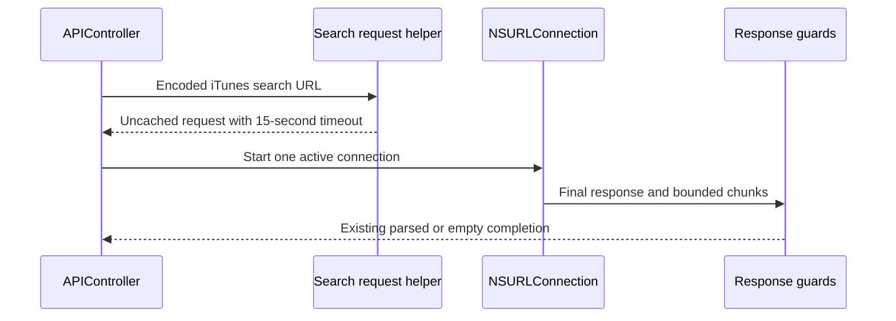

# fix: Bound iTunes search request transport

## Summary

Give iTunes search requests an explicit no-cache policy and a bounded timeout,
matching the repository's existing artwork transport posture without changing
the endpoint, response parsing, or legacy networking framework.

---

## Problem Frame

`ArtworkRequest` explicitly ignores local cache data and times out after 15
seconds, while `APIController` creates its search request with `NSURLRequest`'s
defaults. A cached search response can therefore outlive the sample's intended
fresh request flow, and a stalled search can retain the network activity state
for the platform default timeout. The request policy is also untested, so a
future regression would not be caught by the maintained baseline.

---

## Requirements

### Request Behavior

- R1. Every iTunes search request must ignore local cache data.
- R2. Every iTunes search request must use a 15-second timeout.
- R3. Search URL construction, query encoding, active-connection ownership,
  response validation, and completion behavior must remain unchanged.

### Verification and Guidance

- R4. Focused XCTest declarations must verify the search request URL, cache
  policy, and timeout.
- R5. The static baseline must reject removal or weakening of the request
  policy and its focused tests.
- R6. Maintainer guidance must describe the bounded, uncached search request
  behavior and preserve the separate URLSession modernization roadmap item.

---

## Key Technical Decisions

- KTD1. Use an `APIController` request-construction helper: this exposes the
  transport policy to deterministic tests while keeping connection creation and
  ownership in `searchItunesFor`.
- KTD2. Reuse `ReloadIgnoringLocalCacheData` and 15 seconds: these values match
  the already-maintained artwork request policy and avoid introducing a second
  transport convention in the sample.
- KTD3. Retain `NSURLConnection`: replacing the networking stack would require
  a broader Swift/toolchain migration and is outside this focused reliability
  change.

---

## High-Level Technical Design

The design is directional: the implementation should retain the current
legacy request lifecycle while inserting one testable request-policy boundary.

---

## Implementation Units

### U1. Centralize the bounded search request policy

- **Goal:** Construct every search request through one helper that applies the
  maintained cache policy and timeout before `NSURLConnection` starts.
- **Files:** `SwiftExample/ApiController.swift`
- **Requirements:** R1, R2, R3
- **Test scenarios:** A valid encoded iTunes URL produces a request with the
  same URL, `ReloadIgnoringLocalCacheData`, and a 15-second timeout; malformed
  search text still completes with an empty result through the existing path.
- **Verification:** Review the production call site to confirm no default
  `NSURLRequest` path remains for iTunes searches.

### U2. Add deterministic regression contracts

- **Goal:** Make the transport policy executable in XCTest and mandatory in the
  portable static baseline.
- **Files:** `SwiftExampleTests/SwiftExampleTests.swift`,
  `scripts/check-baseline.py`
- **Requirements:** R4, R5
- **Test scenarios:** The focused XCTest asserts URL preservation, exact cache
  policy, and exact timeout; isolated mutations to the helper invocation,
  cache policy, timeout, or assertions fail the baseline.
- **Verification:** Confirm the test target still includes the maintained test
  file and the checker fails closed when any transport contract is weakened.

### U3. Synchronize repository guidance

- **Goal:** Document the search request policy and its verification boundary
  without claiming live iTunes or local Xcode execution.
- **Files:** `README.md`, `SECURITY.md`, `VISION.md`, `CHANGES.md`, `AGENTS.md`
- **Requirements:** R6
- **Test scenarios:** Documentation identifies the uncached 15-second policy,
  keeps URLSession modernization separate, and contains no credentials or
  private endpoint guidance.
- **Verification:** The static baseline requires the guidance and the final
  diff contains only the planned source, test, checker, plan, and documentation
  paths.

---

## Scope Boundaries

### In Scope

- The request object used by the existing iTunes search connection.
- Focused request-policy tests, static mutation contracts, and synchronized
  maintainer documentation.

### Deferred to Follow-Up Work

- Migrating `NSURLConnection`, legacy Swift syntax, and JSON parsing to modern
  URLSession and Codable APIs.

### Out of Scope

- Changing the public iTunes endpoint, search term, query parameters, response
  schema, result presentation, artwork transport, or UI lifecycle.
- Claiming simulator, device, live iTunes, or Xcode execution from Linux.

---

## Risks and Dependencies

- The project requires a compatible historical Xcode toolchain for native
  compilation and XCTest execution; Linux validation remains static.
- The cache-policy constant and timeout semantics must remain compatible with
  the checked-in Swift/Xcode version.
- Hosted macOS project validation is the authoritative platform check after the
  branch is pushed.

---

## Acceptance Examples

- AE1. Given a valid encoded iTunes search URL, when the controller constructs
  its request, then the URL is unchanged, cached data is ignored, and the
  timeout is 15 seconds.
- AE2. Given a future change that restores the default request initializer or
  changes the timeout, when the maintained baseline runs, then it fails before
  the change can ship.
- AE3. Given the completed change on Linux, when verification is reported,
  then Xcode-dependent execution is identified as unavailable rather than
  presented as locally tested.

---

## Work Completed

- Centralized iTunes search request construction in `APIController` with
  `ReloadIgnoringLocalCacheData` and a 15-second timeout.
- Added focused XCTest declarations for URL preservation, cache policy, and
  timeout behavior while retaining the existing connection lifecycle.
- Extended the portable baseline and maintainer guidance so policy, helper,
  test, and documentation regressions fail closed.

## Verification Completed

- Repository-root `make check` passed the maintained static baseline.
- The absolute Makefile gate passed from `/tmp`.
- Seven isolated hostile mutations were rejected for request policy, timeout,
  helper use, XCTest assertions, README guidance, and completed-plan evidence.
- Exact diff, generated-artifact, conflict-marker, and changed-line
  secret-signature audits passed.
- The stacked exact head passed canonical push run `27660232377` and
  pull-request run `27660233808`; both baseline jobs completed successfully.
- `xcodebuild` was unavailable on Linux, so local simulator, XCTest, and live
  iTunes execution were not claimed.
